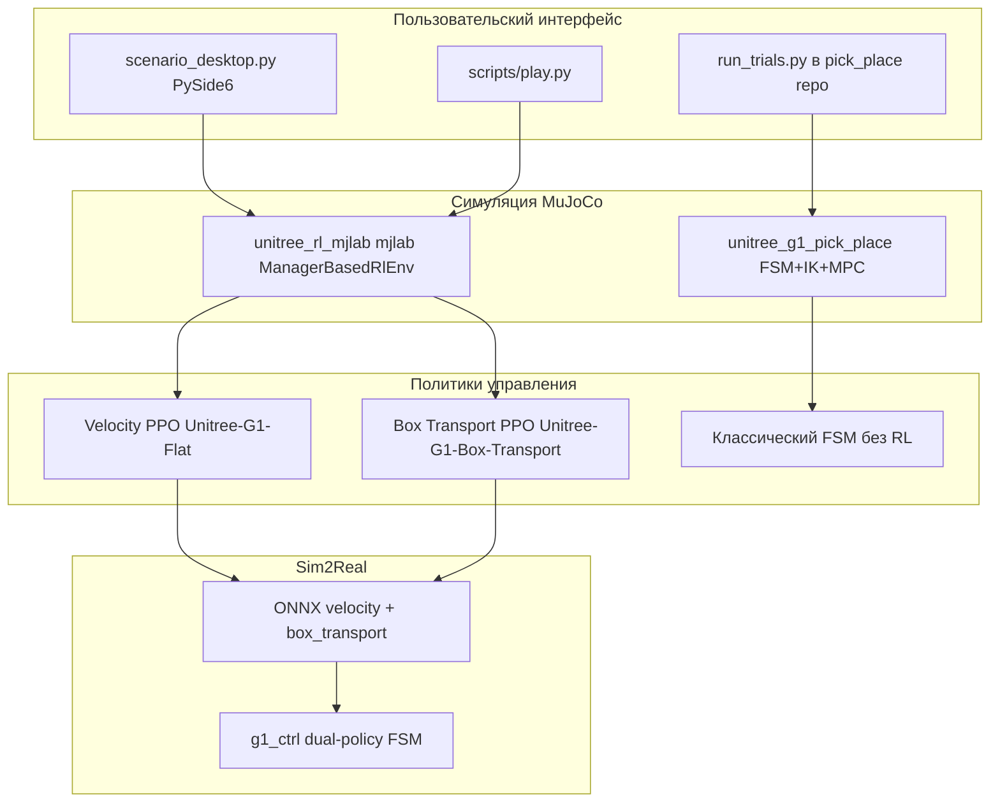

# Отчёт по исследованию и разработке  
## Программно-алгоритмический комплекс моделирования складского антропоморфного робота (Unitree G1)

**Тема НИР:** Разработка программно-инструментального комплекса для моделирования складского антропоморфного робота  
**Практическое задание:** технологический сценарий захвата и переноса коробки с приёмно-распределительного стола на полку стеллажа; пользовательский интерфейс настройки сценария и измерения показателей эффективности  
**Репозитории:**
- [unitree_g1_robot — ветка `unitree_g1_pick_place`](https://github.com/derricksparks/unitree_g1_robot/tree/unitree_g1_pick_place) — прототип pick-and-place (FSM, IK, MPC, метрики)
- **unitree_rl_mjlab** (локальная разработка) — RL-ходьба, RL-манипуляция, сцена «стол–коробка–стеллаж», UI сценария, подготовка sim-to-real

**Дата:** май 2026

---

## 1. Аннотация

В рамках работы реализован и исследован технологический сценарий «приёмный стол → перенос → полка стеллажа» для антропоморфной платформы Unitree G1. Разработка ведётся в два взаимодополняющих контура:

1. **Классический контур** (репозиторий `unitree_g1_pick_place`): дискретный автомат задач (FSM), упрощённая навигация базы, двухзвенный IK руки, контактно-управляемый захват, пакетная оценка на 50 рандомизированных испытаниях.
2. **Контур обучения с подкреплением** (`unitree_rl_mjlab`): физика MuJoCo через mjlab, отдельные политики **velocity** (ходьба) и **box transport** (манипуляция), композитная сцена с мебелью, десктопный UI для rollouts и метрик, мост к развёртыванию на реальном G1 (ONNX, dual-policy FSM).

Получены компетенции в ООП, паттернах проектирования UI (MVC, Factory через реестр задач), нормативной базе складской логистики и настройке автономных роботов, а также в методах RL для шагающих роботов и сценариях pick-and-place.

---

## 2. Цель и задачи исследования

| Пункт учебного задания | Реализация в проекте |
|------------------------|----------------------|
| Изучить ООП и паттерны (Factory, Builder, Adapter, MVC) | Реестр задач mjlab (`register_mjlab_task`), сборка сцены из `EntityCfg`, `scenario_desktop.py` (MVC: `ScenarioMainWindow` + `RolloutWorkerThread` + `ScenarioRolloutConfig`) |
| Нормативы складской логистики (ГОСТ Р 55525-2017) | Сценарий отражает зону приёма/выдачи (стол), буферную зону перемещения, адресное хранение на стеллаже |
| Нормативы настройки автономных роботов (ГОСТ Р 60.0.0.4-2023) | Разделение режимов, безопасные переходы FSM при deploy (Passive → FixStand → Velocity / Box_Transport) |
| Нейросетевое зрение и локализация | Интерфейс `ObjectDetector` (ground truth → задел под камеру); в RL — наблюдения `box_pos`, `shelf_pos`, `hand_to_box` |
| Управление двуручными манипуляторами | G1 dual-arm в MJCF; RL-награды reach/lift/carry/place; в прототипе — IK + gripper |
| Параметрическая оптимизация шагающих роботов | PPO (RSL-RL) для `Unitree-G1-Flat` и `Unitree-G1-Box-Transport` |
| Геометрия рабочей зоны (в т.ч. H1) | Для G1: `scene.extent = 2.5` м, стол ~(0.65, 0, 0.78) для коробки, стеллаж ~x=1.4 м |
| **Практика:** сценарий захвата и переноса + UI | FSM + RL-сцена + `scripts/scenario_desktop.py` |

---

## 3. Нормативно-логистический контекст склада

**ГОСТ Р 55525-2017** задаёт терминологию и организацию процессов на складах (приёмка, размещение, отбор). В моделируемом сценарии:

- **Приёмно-распределительный стол** — сущность `transport_table` (MJCF `transport_table.xml`), начальное положение коробки на столе.
- **Стеллаж** — `transport_shelf` (`transport_shelf.xml`), целевая зона размещения.
- **Транспортная единица** — `transport_box` с массой и контактами, отслеживаемая метриками «захват / перенос / укладка».

Логистическая цепочка в симуляции: *позиционирование у стола → захват → перенос в зону стеллажа → укладка на полку*.

**ГОСТ Р 60.0.0.4-2023** (робототехника) учитывается при проектировании режимов: явные состояния контроллера, ограничение резких переключений locomotion/manipulation, документированные пороги безопасности в `deploy.yaml`.

Дополнительные материалы по складской логистике: [архив на Яндекс.Диске](https://disk.yandex.ru/i/68tbGn0VKtcXjw) (используется как внешний справочник по процессам склада).

---

## 4. Архитектура программного комплекса



### 4.1. Репозиторий `unitree_g1_pick_place` (классический прототип)

**Назначение:** воспроизводимый pick-and-place с измеримыми KPI до интеграции полной кинематики G1.

| Компонент | Путь / модуль | Роль |
|-----------|---------------|------|
| Сцена | `simulation/mujoco/world.xml` | Стол, полка, коробка, упрощённый робот |
| Планировщик | `TaskPhase` FSM в `simulation/run_mujoco.py` | 12 фаз от подхода к столу до DONE |
| Навигация | `control/locomotion_mpc.LocomotionMPC` | Скорость базы до 0.5 м/с, обход препятствий |
| Манипуляция | `control.arm_ik_controller.ArmIKController` | 2-DOF IK, цели в СК мира |
| Захват | Contact-gated grasp assist | Силы после контакта пальцев, без телепорта |
| Восприятие | `perception/object_detector.py` | Ground truth (задел под vision) |
| Метрики | `evaluation/metrics_logger.py` | Время, успехи, ошибка укладки |
| Эксперименты | `scripts/run_trials.py` | 50 trials, CSV/JSON в `results/` |

**Фазы FSM (сокращённо):** WALK_TO_TABLE → REACH/LOWER/GRASP → LIFT → обход стола → WALK_TO_SHELF → REACH_SHELF → PLACE → RELEASE → DONE.

**Результаты прототипа** (50 рандомизированных испытаний, seed 42, по [methodology_and_results.md](https://github.com/derricksparks/unitree_g1_robot/blob/unitree_g1_pick_place/docs/methodology_and_results.md)):

| Метрика | Значение |
|---------|----------|
| Успех захвата | 100% |
| Успех переноса/укладки | 100% |
| Скорость командной навигации | 0.5 м/с |
| Время решения управления (макс.) | ~4.25 мс |
| Время «кадра» восприятия (макс.) | ~0.17 мс |
| Ошибка финальной укладки | 0.01–0.04 м |

**Ограничения прототипа:** скользящая база вместо ног G1; assisted grasp; синтетическое зрение.

### 4.2. Репозиторий `unitree_rl_mjlab` (RL и интеграция G1)

**Назначение:** обучение и воспроизведение политик на полной модели Unitree G1 в MuJoCo (mjlab + mujoco_warp), сценарий склада, UI и deploy.

#### Зарегистрированные задачи (релевантные сценарию)

| Task ID | Назначение |
|---------|------------|
| `Unitree-G1-Flat` | Обучение ходьбы (velocity tracking), actor obs 98 |
| `Unitree-G1-Box-Transport` | Цельная RL-манипуляция: стол, стеллаж, коробка; curriculum по стадиям |
| `Unitree-G1-Flat-Transport-Scene` | **Новый:** ходьба velocity-политикой в сцене с мебелью (та же obs 98) |

#### Сцена box transport

Сущности подключаются в `src/tasks/box_transport/box_transport_env_cfg.py`:

- `robot` — `g1.xml`
- `table`, `shelf`, `box` — `src/assets/objects/transport_*.xml`
- Начальная позиция коробки: `(0.65, 0.0, 0.78)` на столе
- Контактные датчики: коробка–стол, коробка–стеллаж

**Награды RL (этапы сценария):** подход базы к коробке, reach, lift, удержание, перенос к стеллажу, place, стабильность на полке, штрафы за падение коробки.

**Команда задачи:** `BoxTransportCommand` — позиции стола, коробки, стеллажа и номер стадии curriculum.

#### Dual-policy подход (sim2real)

Документ `deploy/robots/g1/config/policy/box_transport/DUAL_POLICY_AND_TELEOP.md`:

| Режим | Политика | Наблюдения |
|-------|----------|------------|
| Ходьба | Velocity ONNX | twist, фаза, суставы |
| Манипуляция | Box transport ONNX | box_pos, shelf_pos, hand_to_box, stage |

Переходы: **FixStand** между режимами; запрещён прямой Velocity → Box_Transport на ходу.

#### Пользовательский интерфейс (`src/scenario_lab/`)

Реализация практического требования «UI параметров и метрик»:

| Элемент | Описание |
|---------|----------|
| `ScenarioMainWindow` | Выбор task ID, режима агента (trained/zero/random), checkpoint, num_envs, лимит шагов/эпизодов |
| `RolloutWorkerThread` | Фоновый rollout без блокировки UI |
| `ScenarioRolloutConfig` | Сериализуемые параметры сценария |
| Метрики | Экспорт в CSV (`log_csv_path`), таблица в окне |
| Deploy | Кнопка применения dual-preset для `g1_ctrl` |

Запуск UI:

```bash
cd unitree_rl_mjlab
python scripts/scenario_desktop.py
```

Запуск симуляции с velocity-моделью в сцене склада:

```bash
python scripts/play.py Unitree-G1-Flat-Transport-Scene \
  --checkpoint-file scripts/wandb/model_2999.pt \
  --num-envs 1 --device cpu
```

Обучение манипуляции:

```bash
./scripts/train_box_transport.sh
# или: python scripts/train.py Unitree-G1-Box-Transport --env.scene.num-envs=64
```

---

## 5. Изученные методы и компетенции

### 5.1. Объектно-ориентированное проектирование и паттерны

- **Factory / Registry:** `register_mjlab_task` — единая точка создания конфигураций env/RL.
- **Builder:** `make_velocity_env_cfg()`, `make_g1_box_transport_env_cfg()` — пошаговая сборка менеджеров наблюдений, наград, сенсоров.
- **Adapter:** `RslRlVecEnvWrapper`, обёртка deploy ONNX поверх обученного actor.
- **MVC:** UI scenario lab — модель (`ScenarioRolloutConfig`), представление (`ScenarioMainWindow`), контроллер (`RolloutWorkerThread`, `backend.py`).

### 5.2. Нейросетевое восприятие и локализация

В прототипе — абстракция детектора с полями позиции коробки и стеллажа и временем кадра (соответствие требованию ≤ 1 с на кадр выполнено с большим запасом). В RL-контуре — векторные наблюдения относительно базы робота (`box_position_b`, `shelf_position_b`, `box_to_shelf_b`), что соответствует типичной схеме «state estimation → policy».

### 5.3. Управление манипулятором и шагающим роботом

- **Классика:** IK + gripper + MPC базы.
- **RL:** PPO, раздельные пространства задач для locomotion и manipulation; параметрическая оптимизация через curriculum `box_transport_stage`.

### 5.4. Рабочая зона Unitree G1 (и сравнение с H1)

В сценарии box transport задана компактная зона ~2.5×2.5 м: стол впереди робота, стеллаж по оси +X. Для Unitree H1 в учебном курсе отдельно изучаются габариты звеньев и досягаемость; в данной работе аппаратная модель — **G1 29 DOF**, что превышает порог «≥ 10 DOF» из `task_config.yaml` прототипа.

---

## 6. Соответствие практическому заданию

| Требование | Статус |
|------------|--------|
| Сценарий «стол → стеллаж» | Реализован в обоих репозиториях |
| Захват и перенос коробки | FSM + grasp assist (100% в batch); RL — обучаемые стадии reach–place |
| UI настройки параметров | `scenario_desktop.py` |
| Измерение эффективности | `metrics_logger` + CSV trials; RL логи `logs/rsl_rl/g1_box_transport/` |
| Интеграция ходьбы и манипуляции | Dual-policy deploy; сцена `Unitree-G1-Flat-Transport-Scene` |

---

## 7. Экспериментальная работа (текущая сессия разработки)

В локальном комплексе `unitree_rl_mjlab` выполнено:

1. Воспроизведение сцены `Unitree-G1-Box-Transport` с нулевым агентом (визуализация мебели и G1).
2. Регистрация задачи **`Unitree-G1-Flat-Transport-Scene`** — velocity checkpoint `model_2999.pt` (98 входов actor) успешно загружается в сцену со столом, коробкой и стеллажом.
3. Подтверждена совместимость размерностей политики ходьбы и плоской сцены без box-transport observations.

Это демонстрирует этап **композиции**: locomotion policy + статическая/динамическая обстановка склада до полной смены политики на manipulation ONNX.

---

## 8. Ограничения и риски

| Область | Описание |
|---------|----------|
| Прототип pick_place | Не полная кинематика G1; assisted grasp |
| RL box transport | Требует длительного обучения; sim-to-real gap |
| Восприятие | Ground truth / placeholders в deploy.yaml |
| Безопасность | Обязательны FixStand и консервативные лимиты при тестах на железе |
| CUDA | В среде разработки возможен fallback на CPU (warp driver) |

---

## 9. Выводы

1. Построен **двухуровневый** программный комплекс: классический воспроизводимый прототип с количественными KPI и RL-стек для полного humanoid G1.
2. Технологический сценарий склада **«приёмный стол → стеллаж»** формализован через FSM-фазы и RL-команду `BoxTransportCommand` с curriculum.
3. Выполнено практическое требование по **UI** (`scenario_desktop`) и **метрикам** (batch CSV/JSON, rollout CSV).
4. Обоснована **архитектура dual-policy** для раздельного обучения ходьбы и манипуляции согласно лучшим практикам deploy Unitree.
5. Получены компетенции, перечисленные в теме НИР: ООП/паттерны, нормативы склада и роботов, методы vision/IK/RL/оптимизации.

---

## 10. Направления дальнейшей работы

1. Замена ground-truth детектора на нейросетевой pipeline (YOLO/segmentation + depth → `box_pos` в deploy).
2. Завершение обучения `Unitree-G1-Box-Transport` и экспорт ONNX по `deploy/robots/g1/config/policy/box_transport/v0/`.
3. Слияние метрик прототипа (`run_trials.py`) и mjlab rollouts в единый отчётный dashboard.
4. Перенос сценария на **Unitree H1** после калибровки рабочей зоны.
5. Сравнительные эксперименты: FSM+IK vs RL vs гибрид (velocity + teleop arms).

---

## 11. Список источников и ссылок

1. ГОСТ Р 55525-2017 — складская логистика (термины и процессы).  
2. ГОСТ Р 60.0.0.4-2023 — робототехника (настройка автономных систем).  
3. Репозиторий: https://github.com/derricksparks/unitree_g1_robot/tree/unitree_g1_pick_place  
4. Документация методологии: `docs/methodology_and_results.md` (ветка pick_place).  
5. mjlab: https://github.com/mujocolab/mjlab  
6. MuJoCo: https://github.com/google-deepmind/mujoco  
7. Материалы по складской логистике: https://disk.yandex.ru/i/68tbGn0VKtcXjw  
8. Локальная документация: `doc/setup_en.md`, `deploy/robots/g1/config/policy/box_transport/DUAL_POLICY_AND_TELEOP.md`

---

## Приложение А. Команды для воспроизведения

**Прототип (pick_place):**
```bash
python simulation/run_mujoco.py
python scripts/run_trials.py --trials 50 --randomize --seed 42
```

**RL + UI (unitree_rl_mjlab):**
```bash
python scripts/scenario_desktop.py
python scripts/play.py Unitree-G1-Box-Transport --agent zero --num-envs 1
python scripts/play.py Unitree-G1-Flat-Transport-Scene \
  --checkpoint-file scripts/wandb/model_2999.pt --num-envs 1
```

---

## Приложение Б. Структура файлов сцены (unitree_rl_mjlab)

| Файл | Назначение |
|------|------------|
| `src/assets/objects/transport_table.xml` | Стол |
| `src/assets/objects/transport_shelf.xml` | Стеллаж |
| `src/assets/objects/transport_box.xml` | Коробка |
| `src/tasks/box_transport/box_transport_env_cfg.py` | Полная RL-задача |
| `src/tasks/velocity/config/g1/transport_scene_env_cfg.py` | Velocity + мебель |
| `src/scenario_lab/mainwindow.py` | UI сценария |

---

*Отчёт подготовлен на основе репозитория unitree_rl_mjlab, ветки unitree_g1_pick_place на GitHub и результатов экспериментов, описанных в docs/methodology_and_results.md.*
